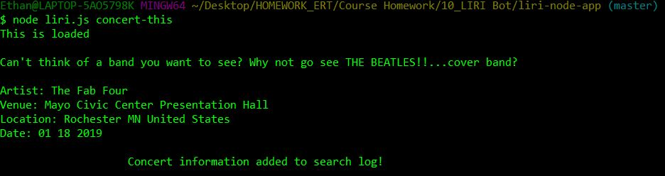
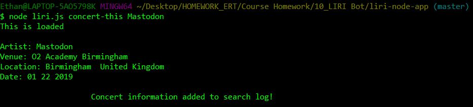
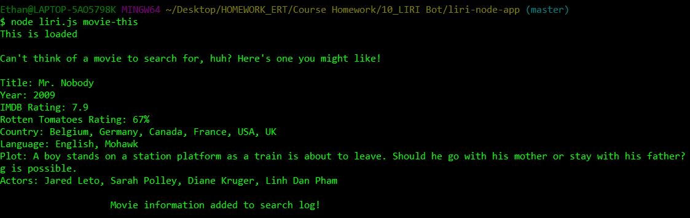
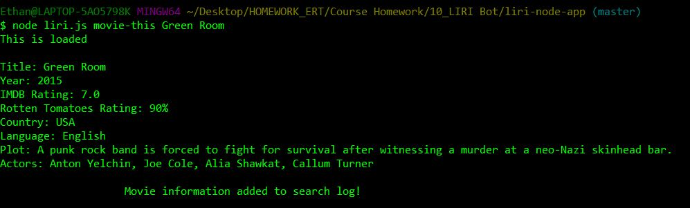
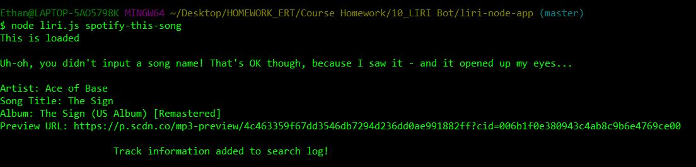
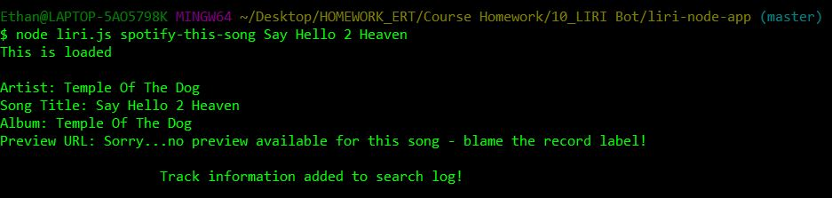
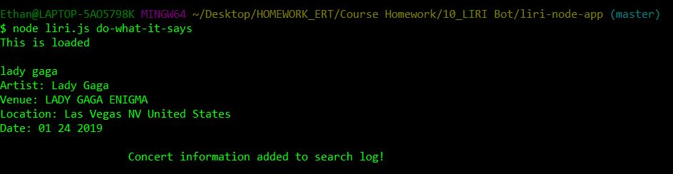
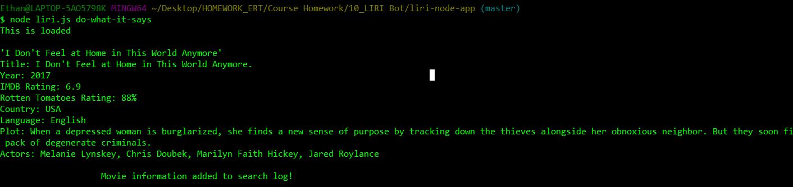
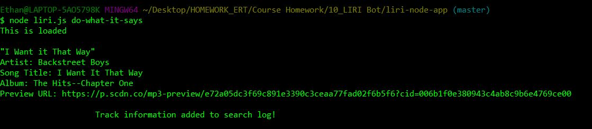

#### The Liri Bot is a program written entirely in JavaScript that runs solely in the command line.
#### Users input one of a series of four commands: *concert-this*, *movie-this*, *spotify-this-song*, or *do-what-it-says*.

#### For the first three commands, following the initial command, users can either input additional information (an artist/band, movie, or song, respectively), or if no additional information is input, the program runs the command with provided default information. The program then outputs information on a concert, movie, or track to the console, and logs the user command and response to the "log.txt".

#### For the final command, the output to the command line is determined by the information in the "random.txt" file.

#### Languages/Technologies Used
* JavaScript
* Node.js
* Axios (npm)
* Dotenv (npm)
* Spotify API (npm)
* Moment (npm)

#### Below you can see screenshot examples of the functionality of the different commands, both with and without additional user information.

### concert-this with no user input &#9660;

### concert-this with user input &#9660;

### movie-this with no user input &#9660;

### movie-this with user input &#9660;

### spotify-this-song with no user input &#9660;

### spotify-this-song with user input &#9660;

#### NOTE: In the above example, you can see a use case where the Spotify API did not have a preview URL listed. I added a conditional event to replace the URL with the above text in the event of no preview URL.

### do-what-it-says (concert-this as first entry in random.txt) &#9660;

### do-what-it-says (movie-this as first entry in random.txt) &#9660;

### do-what-it-says (spotify-this-song as first entry in random.txt) &#9660;
